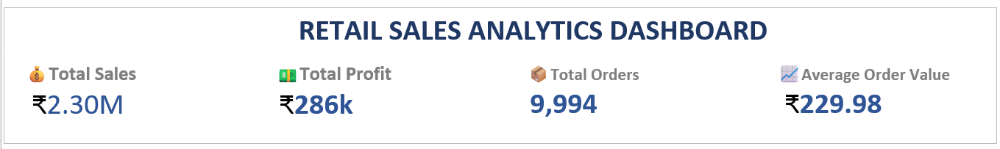

# 📊 Retail Sales Analytics Dashboard using SQL & Microsoft Excel

## 📌 Project Overview

This project analyzes retail sales data using SQL and presents key business insights through an interactive Microsoft Excel dashboard. The dashboard includes KPI cards, PivotTables, PivotCharts, and Slicers to help analyze sales performance across categories, regions, customer segments, products, and customers.

---

## 🖼 Dashboard Preview

---

## 🛠 Tools Used

- Microsoft Excel
- SQL (MySQL)
- PivotTables
- PivotCharts
- Slicers

---

## 📈 Dashboard Features

- 💰 Total Sales KPI
- 💵 Total Profit KPI
- 📦 Total Orders KPI
- 📊 Average Order Value
- 📂 Sales by Category
- 🌍 Sales by Region
- 👥 Sales by Segment
- 🏆 Top 10 Products
- ⭐ Top 10 Customers
- 🎛 Interactive Slicers

---

## 📂 Project Files

- Retail_Sales_Dashboard.xlsx
- Retail_Sales_SQL.sql
- Sample-Superstore.csv

---

## 💡 Skills Demonstrated

- SQL Queries
- Data Cleaning
- Data Analysis
- KPI Dashboard Design
- PivotTables
- PivotCharts
- Data Visualization
- Business Intelligence

---

## 👨‍💻 Author

**Varad Mohanpurkar**
